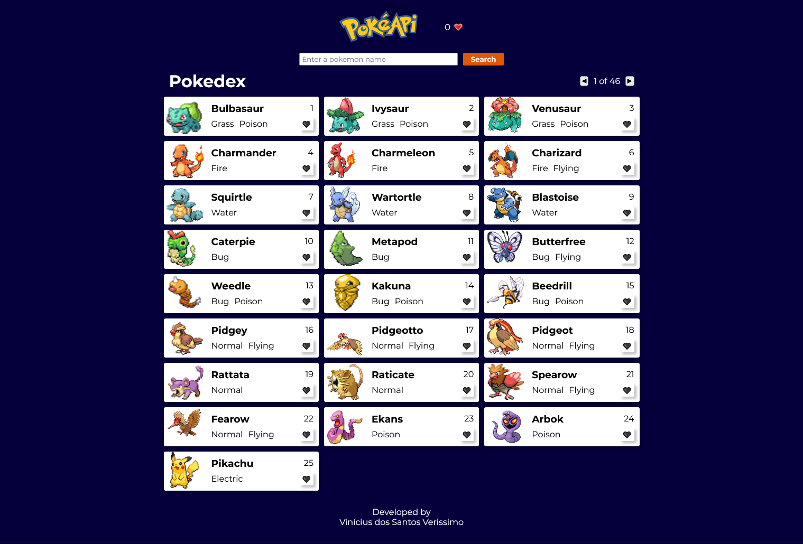

# A Pokedex using PokeAPI

## Overview

### Screenshot

### Links

<!-- -   Solution URL: https://viniciusdsv93.github.io/Tip-calculator/ -->

## My process

### Built with

-   Semantic HTML5 markup
-   CSS custom properties
-   Flexbox
-   Grid
-   Media Queries
-   JavaScript
-   React

### What I learned

In this project i could use React JS to build a simple pokedex using data from the PokeAPI.

## Author

-   GitHub - Vinícius dos Santos Verissimo (https://github.com/viniciusdsv93)
